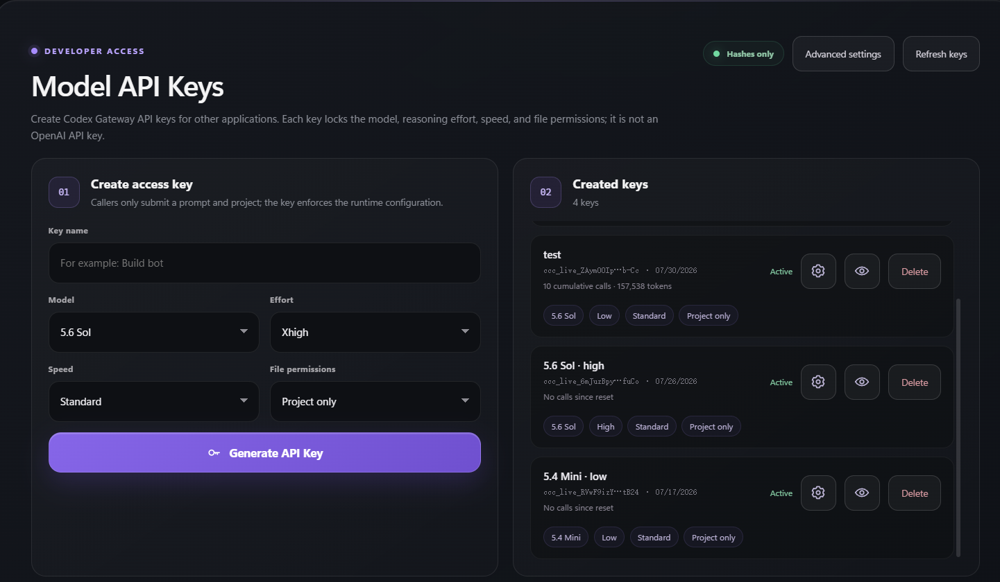
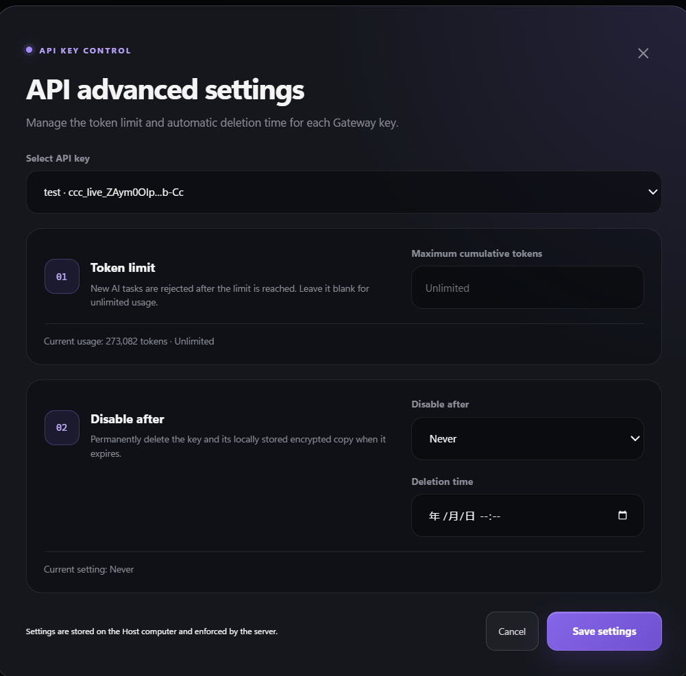

# Agent Gateway

Agent Gateway is a Windows desktop gateway, debugging tool, and control console for AI coding agents.

[Platform](https://platform.agentgatewayplatform.cc/) · [Download](https://github.com/daizhongtian/Agent-Gateway/releases/latest) · [API contract](docs/openapi.yaml) · [简体中文](README.zh-CN.md)

Agent Gateway is an independent open-source project. It is not an OpenAI product and is not developed, endorsed, or supported by OpenAI.

## Overview

Agent Gateway is designed as one entry point for multiple coding agents, including ChatGPT/Codex, Claude Code, and Gemini. It brings tasks, models, project permissions, live logs, results, Gateway keys, and token usage into one application.

The current release ships with the Codex SDK provider first. As additional coding agents are added, client applications can continue using the same Gateway address and calling pattern.

## Use cases

- **Develop and debug AI-agent products:** test agents, automations, IDE extensions, and internal applications through a simulated OpenAI-compatible API.
- **Call agents across devices and applications:** let local programs, other computers, phones, and internal tools call the coding agent running on the Host computer.
- **Manage access:** create a separate Gateway key for each person or application, then restrict, expire, or revoke it independently.
- **Monitor usage:** track calls, tokens, latency, status, and model usage per Gateway key, with optional cumulative token limits.
- **Lower calling costs:** use a unified provider subscription to reduce costs compared with per-token APIs.

### Gateway key management

Create model-bound Gateway keys and control their model, reasoning effort, speed, file permissions, token limit, and expiration.





## Quick start

### Windows desktop

1. Download the latest installer or Portable EXE from [GitHub Releases](https://github.com/daizhongtian/Agent-Gateway/releases/latest).
2. Start Agent Gateway, select **Connect to ChatGPT**, and complete sign-in in the browser.
3. Enable **API Host**.
4. Open **API Keys & Usage** and create a `ccc_live_...` Gateway key.

For applications running on the Host computer:

```text
base_url = http://127.0.0.1:4310/v1
api_key  = ccc_live_GatewayKeyGeneratedByThisApp
```

### Optional Online Host

Sign in to a [Platform](https://platform.agentgatewayplatform.cc/) account from the desktop app and select **Online Host** or **Share online**. The app registers and pairs the device, then displays its public `OPENAI HOST` address. No Tailscale installation or configuration is required.

Use the exact Host-specific address displayed by the app:

```text
base_url = https://api.agentgatewayplatform.cc/h/your-host-id/v1
api_key  = ccc_live_GatewayKeyAssignedByTheHostAdmin
```

Online Host is optional. Local API Host calls work without a Platform account. For local Platform development, see [platform/README.md](platform/README.md).

## API example

Install the official OpenAI Python client and point it at Agent Gateway:

```python
from openai import OpenAI

client = OpenAI(
    base_url="http://127.0.0.1:4310/v1",
    api_key="ccc_live_...",
)

model = client.models.list().data[0].id
response = client.responses.create(
    model=model,
    input="Reply with exactly: connected",
)

print(response.output_text)
```

Main compatibility endpoints:

```text
GET  /v1/models
POST /v1/responses
POST /v1/chat/completions
```

Normal responses, SSE streaming, compatible errors, `X-Request-Id`, and Base64 PNG, JPEG, or WebP image input are supported. For polling, cancellation, project directories, file uploads, and native task events, use the `/api/v1/external` API documented in the [OpenAPI contract](docs/openapi.yaml).

## Core features

- Windows desktop task console with live status and logs.
- Model, reasoning effort, speed, project, and file-permission controls.
- Gateway key creation, encrypted local recovery, independent usage tracking, token limits, expiration, and permanent deletion.
- OpenAI-compatible Responses and Chat Completions, including SSE streaming, image input, and caller-defined function tools with automatic tool selection.
- Native asynchronous tasks, attachments, cancellation, SSE events, and an optional WebSocket channel.
- Local API Host controls and one-click Online Host through the hosted Platform and Relay.
- Platform accounts with optional recovery email, persistent sign-in, and automatic device pairing.
- Performance tests with an isolated Fake AI Provider and regression baselines.

## Privacy and security

`ccc_live_...` Gateway keys are generated by Agent Gateway; they are not OpenAI API keys. Keep them secret, use separate least-privilege keys, and configure token limits or expiration for shared access.

Online Host uses HTTPS/WSS in transit, but it is not end-to-end encrypted against the Platform operator: the public Edge or Relay can process request bodies, attachments, streams, and errors. The selected model provider also processes submitted content. Review [PRIVACY.md](PRIVACY.md) and [SECURITY.md](SECURITY.md) before exposing a Host publicly.

## Run from source

```powershell
npm ci
npm start
```

Run only the headless HTTP service:

```powershell
npm run server
```

Platform development has separate Java, Node.js, PostgreSQL, and Docker instructions in [platform/README.md](platform/README.md).

## Documentation

- [HTTP API contract](docs/openapi.yaml)
- [Platform and Relay](platform/README.md)
- [Performance tests](performance-tests/README.md)
- [Security](SECURITY.md)
- [Privacy](PRIVACY.md)
- [Contributing](CONTRIBUTING.md)
- [Third-party notices](THIRD_PARTY_NOTICES.md)
- [MIT License](LICENSE)
