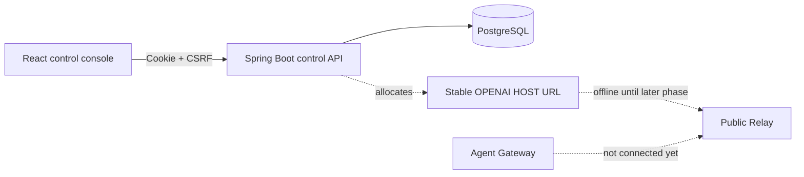

# Platform architecture

## Current boundary



The control plane can allocate a stable address before the data plane exists. Allocation must never be interpreted as proof that a device is online.

## Credential separation

| Credential | Consumer | Stored by platform | Purpose |
| --- | --- | --- | --- |
| Browser access token | React console | SHA-256 hash only | Short control-plane session |
| Browser refresh token | React console | SHA-256 hash only | Rotating session renewal |
| Pairing code | Account owner + desktop | SHA-256 hash only | One-time device enrollment |
| Device secret | Desktop app | SHA-256 hash only | Long-lived device identity |
| Tunnel token | Desktop tunnel agent | SHA-256 hash only | Short-lived Relay admission |
| `ccc_live_...` | Third-party OpenAI client | Never persisted in cloud | Local Gateway authorization |
| Codex/OpenAI credential | Local Codex runtime | Never received by platform | Model execution |

## Deployment domains

Recommended production split:

```text
console.example.com         React UI
account.example.com         Spring Boot control API
relay.example.com           Desktop WSS connections
*.api.example.com           Public OpenAI-compatible Host addresses
```

Keeping the control-plane cookie host separate from public Host subdomains prevents public API traffic from receiving account cookies.
